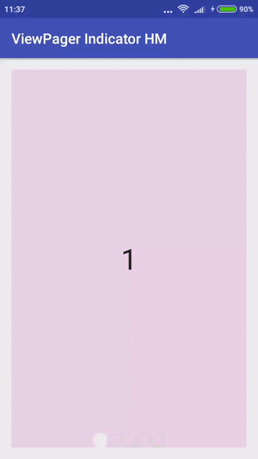

# Android ViewPager Indicator
Lightweight library to display Android ViewPager indicator with custome images.

#How to use
In your layout
```
<com.hembitski.hmviewpagerindicator.VPIndicator
        android:id="@+id/viewPagerIndicator"
        android:layout_width="wrap_content"
        android:layout_height="20dp" />
```
I your onCreate
```
        ViewPager viewPager = (ViewPager) findViewById(R.id.viewPager);
        Adapter adapter = new Adapter(getSupportFragmentManager());
        viewPager.setAdapter(adapter);

        VPIndicator indicator = (VPIndicator) findViewById(R.id.viewPagerIndicator);
        indicator.setParams(viewPager);
```



# Download
Maven:
```
<dependency>
  <groupId>com.github.hmikalai</groupId>
  <artifactId>hmvpindicator</artifactId>
  <version>1.0.1</version>
  <type>pom</type>
</dependency>
<dependency>
  <groupId>com.google.android</groupId>
  <artifactId>support-v4</artifactId>
  <version>r7</version>
</dependency>
```

Or use Gradle:
```
repositories {
        maven {
            url 'https://dl.bintray.com/mikalai/maven'
        }
    }
    
dependencies {
    compile 'com.github.hmikalai:hmvpindicator:1.0.1'
    compile 'com.android.support:appcompat-v7:24.2.0'
}
```
